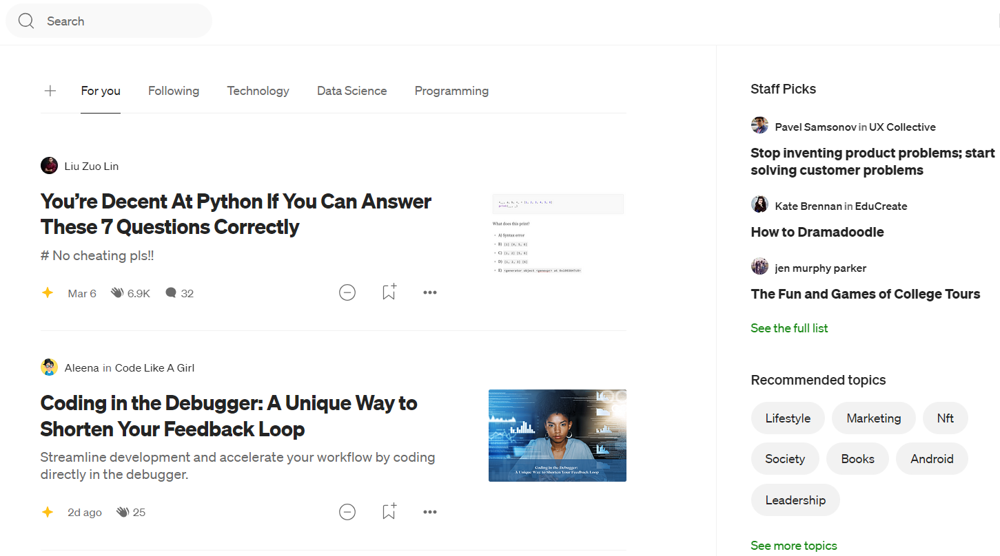

## Inleiding

De Quinacare-website is meer dan een digitaal visitekaartje; het is een essentieel platform voor het communiceren van de missie, het informeren van bezoekers en het aantrekken van donateurs en vrijwilligers. De huidige website dient deze doelen goed en wordt vaak geprezen, maar de komst van nieuwe technologieën in de afgelopen jaren biedt nu de kans om significante verbeteringen door te voeren. Deze aanpassingen zullen niet alleen de prestaties en functionaliteit van de site verbeteren, maar ook het onderhoud op de lange termijn vergemakkelijken. Dit document bespreekt waarom deze updates noodzakelijk zijn, hoe we dit stapsgewijs kunnen aanpakken, en welke voordelen dit op de lange termijn oplevert.

### Waarom een update nodig is

### Technologische Vooruitgang

Het internet evolueert voortdurend, en technologieën die vroeger uitstekend werkten, kunnen na verloop van tijd achterhaald raken. Hoewel de huidige website zeer goed functioneert, beperkt het gebruik van verouderde technologie de mogelijkheden om te voldoen aan de nieuwste webstandaarden, gebruikersverwachtingen en veiligheidsnormen. Moderne technologieën bieden aanzienlijke voordelen:

- **Betere prestaties**: Nieuwe technologieën zorgen voor aanzienlijk snellere laadtijden, soms tot wel 100 keer sneller. Dit is vooral belangrijk voor gebruikers met tragere internetverbindingen of mobiele apparaten. Terwijl de huidige site tot 10 seconden nodig heeft om te laden, kunnen we met nieuwe technologieën dit terugbrengen naar enkele honderden milliseconden per pagina, wat honderd keer sneller is.

- **Lagere serverbelasting en kosten**: Dankzij geautomatiseerde optimalisatieprocessen en voorgegenereerde pagina's kan de belasting op de server drastisch worden verminderd. Dit leidt niet alleen tot lagere hostingkosten, maar vermindert ook de benodigde opslagruimte. De huidige servergrootte van 15 GB kan bijvoorbeeld teruggebracht worden naar slechts 15 MB is de verwachting, een reductie met een factor 1000.

- **Energie-efficiëntie**: Snellere, lichtere websites verbruiken minder energie, zowel aan de serverzijde als bij de gebruiker. Dit draagt bij aan Quinacare duurzaamheidsdoelstellingen.

### Verbeterde Veiligheid en Minder Onderhoud

Een belangrijke reden voor de technologische upgrade is de verhoogde veiligheid. Dynamische websites zoals die op WordPress draaien, zijn vaak afhankelijk van databases en talloze plugins die regelmatig moeten worden bijgewerkt om beveiligingsrisico's te minimaliseren. Dit proces zelf is niet zonder risico's en kan de site tijdelijk onbruikbaar maken, zoals we recentelijk hebben ervaren.

- **Minder kwetsbaarheden**: Een statische site heeft geen database en genereert geen dynamische content, waardoor de kans op aanvallen zoals SQL-injecties of cross-site scripting aanzienlijk kleiner is. Dit vermindert het aantal kwetsbaarheden en maakt de site intrinsiek veiliger.

- **Geen afhankelijkheid van plugins**: De overstap naar een nieuw systeem vermindert de afhankelijkheid van externe plugins, wat resulteert in een stabieler systeem dat minder onderhoud vereist. Hierdoor kunnen we bijvoorbeeld directe koppelingen met betalingssystemen realiseren, zonder tussenkomst van plugins. Deze koppelingen zijn goed gedocumenteerd en er zijn talloze voorbeelden te vinden hoe die te realizeren.

- **Automatische updates en versiebeheer**: De migratie naar een systeem dat gebruik maakt van markdown-bestanden voor contentbeheer maakt versiebeheer eenvoudiger. Dit zorgt voor een overzichtelijke, gecontroleerde manier van contentbeheer, waarbij we eenvoudig wijzigingen kunnen bijhouden en eerdere versies kunnen herstellen indien nodig.

#### Huidige Back-up Risico's

De omvang van de huidige website, inclusief alle documenten en databases, maakt het moeilijk om betrouwbare back-ups te maken. Dit vormt een groot risico bij een systeemcrash of cyberaanval. Door de site te updaten, wordt dit risico sterk verminderd. Het eenvoudiger beheren van bestanden maakt regelmatige, volledige back-ups overbodig, wat de betrouwbaarheid van onze site verhoogt en het herstelproces na incidenten versnelt.

### Functionaliteiten voor Een Betere Website

Naast de technische voordelen biedt de nieuwe technologie ruimte voor het toevoegen van nieuwe functionaliteiten die de gebruiksvriendelijkheid en professionaliteit van de website verder verbeteren:

- **Responsief ontwerp**: De website kan volledig responsief worden gemaakt, wat betekent dat deze optimaal functioneert en er goed uitziet op alle apparaten, van smartphones tot desktops. Dit is essentieel, aangezien een groeiend aantal gebruikers de website via mobiele apparaten bezoekt.

- **Intuïtieve navigatie**: Een herstructurering van de inhoud en het ontwerp zal resulteren in een eenvoudiger, meer logische navigatie. Dit helpt bezoekers snel en gemakkelijk de informatie te vinden die ze nodig hebben, wat hun tevredenheid en betrokkenheid vergroot.

- **Globale zoekfunctie**: Een belangrijke verbetering voor de nieuwssectie is de toevoeging van een globale zoekfunctie. Hierdoor kunnen gebruikers de hele site doorzoeken op specifieke zoektermen, wat hen helpt snel relevante informatie te vinden.

- **Automatische spellings- en grammaticacontrole**: De site kan aan de administratieve kant worden voorzien van een geïntegreerde spellings- en grammaticacontrole, die ervoor zorgt dat alle content foutloos is. Dit draagt bij aan een professionele en betrouwbare uitstraling.

- **Automatische synchronisatie tussen talen**: De nieuwe site kan geautomatiseerde processen bevatten voor het beheren van vertalingen, waardoor het gemakkelijker wordt om inhoud in meerdere talen up-to-date te houden. Content kan snel automatisch gegenereerd worden, en neemt een groot gedeelte van het werk weg. Na controle kan de content live worden gezet.

- **Bestandsoptimalisatie**: Afbeeldingen en documenten worden automatisch geoptimaliseerd voor snellere laadtijden en betere prestaties. Dit betekent dat bijvoorbeeld afbeeldingen en PDF's automatisch worden aangepast om de beste gebruikerservaring te bieden. Dit kan in veel gevallen tot 1000 keer kleinere files leiden.

- **Geen cookies en minimale JavaScript**: De nieuwe technologie maakt het mogelijk om zonder cookies en met minimaal gebruik van JavaScript te werken, wat zowel de privacy van gebruikers waarborgt als de snelheid en toegankelijkheid van de site verbetert. De homepage vergt momenteel bijna 2Mb aan JavaScript, wat op trage verbindingen tot 16s downloadtijd vergt.

### Effectievere Fondsenwerving en Vrijwilligerswerving

Het aantrekken van donateurs en vrijwilligers is cruciaal voor het ondersteunen van Quinacare's missie. Hoewel de huidige website hierin voorziet, kunnen we deze processen aanzienlijk optimaliseren door nieuwe technologieën te integreren. Dit is geen eenmalige stap; het is een doorlopend proces dat elke 3 tot 5 jaar moet worden geëvalueerd en bijgewerkt. Door de website nu te vernieuwen, leggen we een stevige basis voor toekomstige verbeteringen.

- **Prominentere oproepen tot actie**: Door strategisch geplaatste knoppen en banners kunnen we donaties en vrijwilligerswerk meer onder de aandacht brengen, waardoor de kans groter wordt dat bezoekers zich betrokken voelen en actie ondernemen.

- **Gebruik van website-analyse**: De huidige website maakt gebruik van Google Analytics, een veelgebruikt, maar inmiddels verouderd systeem voor het volgen van gebruikersactiviteit op websites. Een belangrijk nadeel van dit systeem is het gebruik van cookies, wat bij veel gebruikers tot bezwaren leidt en ertoe kan leiden dat ze cookies uitschakelen in hun browser. Bovendien wordt Google Analytics verdacht van schending van de Europese privacywetgeving onder de GDPR/AVG. Gelukkig zijn er alternatieven beschikbaar die deze nadelen niet hebben.

Het monitoren van gebruikersgedrag biedt waardevolle inzichten in welke content effectief is voor de doelgroepen. Hierdoor kunnen we de berichtgeving beter afstemmen op hun behoeften en voorkomen dat we tijd besteden aan content die weinig bijdraagt aan de doelstellingen van de website. Webanalyse zou een regelmatig terugkerend proces moeten zijn om de inhoud van de website continu te optimaliseren.

- **Vereenvoudigd donatieproces**: Een eenvoudig en gebruiksvriendelijk donatieproces vergroot de kans op succesvolle donaties en aanmeldingen voor vrijwilligerswerk, wat direct bijdraagt aan de doelstellingen. Een belangrijke maatstaf voor websites is de conversie, oftewel het percentage bezoekers dat daadwerkelijk donateur wordt of zich als vrijwilliger aanmeldt. Hoewel bezoekers vrij zijn om de site te verkennen, is het doel hen te overtuigen van de missie en hen te bewegen tot actie, zoals doneren of inschrijven. Een succesvolle conversie betekent dat de bezoeker zich op een betekenisvolle manier aan Quinacare heeft verbonden. Daarom is het van groot belang om de conversie te optimaliseren. Aan de ene kant bieden de eerder genoemde website-analyses inzicht in dit proces, en aan de andere kant weten we dat een eenvoudiger donatieproces en verbeterde zoekmogelijkheden het conversiepercentage aanzienlijk kan verhogen.

- **Specifieke content voor vrijwilligers**: Door content te ontwikkelen die gericht is op potentiële vrijwilligers, kunnen we hen effectiever informeren en enthousiasmeren voor onze projecten. Dit kan onder meer door een "vacature"-pagina te creëren met beschikbare posities in zowel Ecuador als Nederland, of door een pagina toe te voegen voor acties zoals sponsor-evenementen, vergelijkbaar met GoFundMe. Door dezelfde betaalportal te gebruiken als voor reguliere donaties, vermijden we de extra kosten die dergelijke platforms doorgaans in rekening brengen.

- **Integratie**: Verschillende integraties kunnen een aanzienlijke meerwaarde bieden door een consistente merkervaring te waarborgen en de communicatie met de achterban te stroomlijnen. Zo kan de nieuwsbrieffunctie volledig vanuit de site worden beheerd, wat het proces van contentcreatie en verzending eenvoudiger, efficiënter en sneller maakt. Bovendien biedt dit de mogelijkheid om de visuele stijl van de nieuwsbrief naadloos te laten aansluiten bij de rest van de website. Integratie van social media zorgt ervoor dat updates direct kunnen worden gedeeld, waardoor onze boodschap een breder publiek bereikt en de betrokkenheid op meerdere platformen wordt vergroot.

## Het Plan van Aanpak
In de bovenstaande tekst zijn verschillende redenen en mogelijkheden voor aanpassingen besproken. Dit proces ingrijpend en tijdrovend, maar ondertussen moet de website tijdens de werkzaamheden voortdurend bereikbaar en betrouwbaar blijven. Om dit te waarborgen, wordt er een gedetailleerd plan van aanpak voorgesteld, waarbij de optimalisatie van de website stap voor stap en gecoördineerd zal plaatsvinden. In eerste instantie wordt slechts een onderdeel van de website aangepakt via een test server, om de haalbaarheid en gebruiksvriendelijkheid te testen. Pas na een succesvolle afronding van deze fase, zal er worden uitgebreid.

### "Nieuws" Pagina
De website biedt momenteel een breed scala aan nieuws en updates over de stichting, lopende acties, vrijwilligerswerk, projectvoortgang en nieuwsbrieven. Het plan is om al deze inhoud te centraliseren op een nieuwe pagina, genaamd `Nieuws`. Deze pagina zal alle gepubliceerde artikelen overzichtelijk per categorie presenteren.

De bovenstaande afbeelding illustreert hoe deze pagina eruit zou kunnen zien. De `Nieuws` pagina zal beschikken over een zoekfunctie waarmee gebruikers snel relevante artikelen kunnen vinden. Bovenaan de pagina worden alle beschikbare categorieën weergegeven, waarmee artikelen eenvoudig kunnen worden gefilterd. Aan de rechterkant zijn tags of onderwerpen te vinden, die een alternatieve manier bieden om snel door de artikelen te navigeren afhankelijk van de interesse van een bezoeker.

Het is belangrijk om te erkennen dat de overgang naar een nieuw systeem tijd en inspanning vergt. Het uiteindelijke doel is echter om een website te realiseren die moderner, efficiënter en eenvoudiger te onderhouden is, en die beter aansluit bij de doelstellingen van de stichting. Door de migratie gefaseerd uit te voeren, beperken we de impact op de gebruikers. We beginnen met een klein onderdeel van de website en breiden dit geleidelijk uit. Dit stelt ons in staat om wijzigingen gecontroleerd door te voeren en eventuele problemen snel aan te pakken. Zo kunnen we de voordelen van de nieuwe technologieën optimaal benutten en de risico’s minimaliseren. De lange termijn voordelen zullen deze inspanningen ruimschoots rechtvaardigen, door het onderhoud van de website te vereenvoudigen, de veiligheid te vergroten en de gebruikerservaring te verbeteren.

### Stap 1: Exporteren en Migreren van Bestaande Artikelen
Deze stap is succesvol getest en afgerond. Artikelen uit de WordPress-site kunnen eenvoudig worden geëxporteerd naar een XML-bestand. Met een bestaande tool kunnen deze bestanden vervolgens worden omgezet naar markdown-bestanden. Deze markdown-bestanden zijn simpele tekstbestanden per artikel, voorzien van metadata zoals de publicatiedatum en de titel. Ik heb een script geschreven dat de tekst opschoont door WordPress-shortcodes te verwijderen en alle in de tekst opgenomen afbeeldingen te downloaden vanaf de Quinacare-website. Hierdoor zijn de artikelen klaar om op de nieuwe website te worden gepubliceerd. Een bijkomend voordeel van deze aanpak is dat alleen de originele afbeeldingen worden gedownload, wat betekent dat ongebruikte afbeeldingen worden uitgesloten. Dit zorgt tevens voor een opschoning van de server.

### Stap 2: Publiceren van de Artikelen
In totaal moeten 263 artikelen (ongeveer 88 per taal) worden gesorteerd en in de juiste mappen geplaatst, waarbij elke taal zijn eigen map krijgt. Ook documenten, zoals nieuwsbrieven, moeten worden gesorteerd. Om de links te optimaliseren, is het aan te raden aparte mappen voor deze bestanden te maken. Er kunnen mogelijk nog andere bestanden zijn die gesorteerd moeten worden. Zodra alles is gesorteerd, zijn de artikelen en bestanden klaar voor publicatie.
Daarnaast heb ik een tool ontwikkeld die analyseert welke vertalingen nog ontbreken en deze automatisch toevoegt en vertaalt. Deze vertaalde bestanden moeten uiteindelijk nog worden gereviewd voordat ze kunnen worden gepubliceerd.

### Stap 3: Testsite Opzetten
Er zal een testsite worden opgezet om verschillende aspecten te evalueren, zoals de leesbaarheid van de artikelen, de correcte weergave van afbeeldingen en documenten, het filteren op tags en categorieën, het wisselen tussen talen, en het doorzoeken van de artikelen. Deze testsite zal parallel draaien aan de bestaande website, zodat de huidige site volledig operationeel blijft. Tijdens deze periode kunnen nieuwe artikelen handmatig worden toegevoegd om de inhoud actueel te houden. De nieuws pagina zal dezelfde look and feel behouden als de huidige website, maar de link naar `BLOGVLOG` zal naar de testsite verwijzen. Alle andere links blijven naar de Quinacare-site leiden.

### Stap 4: Optimalisaties
Op basis van de testresultaten zullen we bepaalde aspecten van de site optimaliseren. Denk hierbij aan het verfijnen van de zoekfunctie, het toevoegen van extra tags aan artikelen, en het definiëren van categorieën om de gebruikerservaring te verbeteren. Daarnaast zullen we enkele scripts uitvoeren om de kwaliteit van de tekst verder te verbeteren:
- **Niet leesbare tekens verwijderen** - Verwijder automatisch niet-ASCII of verborgen tekens. [remove-markdown](https://www.npmjs.com/package/remove-markdown) - `npm install remove-markdown`
- **Dubbele spaties verwijderen** - Detecteer en verwijder dubbele spaties. [markdownlint](https://github.com/DavidAnson/markdownlint) - `npm install markdownlint-cli`
- **Spellings- en grammaticacontrole** - Controleer automatisch op spelling- en grammaticafouten. [cspell](https://github.com/streetsidesoftware/cspell) - `npm install cspell`
- **Interpunctiecontrole** - Verifieer het juiste gebruik van leestekens. [markdownlint](https://github.com/DavidAnson/markdownlint) - `npm install markdownlint-cli`
- **Hoofdlettergebruik controle** - Controleer het juiste gebruik van hoofdletters. [markdownlint](https://github.com/DavidAnson/markdownlint) - `npm install markdownlint-cli`
- **Stijl en toon consistentie** - Zorg ervoor dat de stijl en toon consistent zijn. [Vale](https://github.com/errata-ai/vale) - `npm install -g vale` (Vale is doorgaans geïnstalleerd via een binair bestand, niet npm)
- **Redundantie eliminatie** - Verwijder automatisch overbodige woorden of zinsdelen. [Alex](https://alexjs.com/) - `npm install alex`
- **Leesbaarheidscontrole** - Controleer en verbeter de leesbaarheid van de tekst. [Alex](https://alexjs.com/) - `npm install alex`
- **Taalgeschiktheid controle** - Zorg ervoor dat het taalgebruik correct is en past bij de doelgroep. [Vale](https://github.com/errata-ai/vale) - `npm install -g vale` (Vale is doorgaans geïnstalleerd via een binair bestand, niet npm)
- **Terminologie consistentie** - Controleer consistentie van sleuteltermen en zinsdelen. [Vale](https://github.com/errata-ai/vale) - `npm install -g vale` (Vale is doorgaans geïnstalleerd via een binair bestand, niet npm)
- **Formatteer controle** - Zorg voor correcte formattering van de tekst. [Prettier](https://prettier.io/) - `npm install prettier`

Deze tools kunnen automatisch op de artikelen worden toegepast, zonder menselijke tussenkomst. Zodra de artikelen worden gepubliceerd, voert het systeem automatisch de controles uit, past het artikel aan indien nodig, en zet het dan op de webserver. 

### Volgende stappen
De volgende stap is om, zodra de tests succesvol zijn afgerond en alles robuust en stabiel blijkt te zijn, de link naar de `Nieuws` pagina op `www.quinacare.org` over te zetten. Vanaf dat moment zal deze pagina live zijn. Vervolgens kunnen we de vaste pagina’s een voor een migreren en andere onderdelen aanpassen. Deze gefaseerde aanpak zorgt ervoor dat de site operationeel blijft terwijl we stapsgewijs onderdelen overzetten, wat problemen minimaliseert. Zodra alle onderdelen zijn gemigreerd, kunnen we de website naar DigitalOcean verplaatsen en BlueHost opzeggen. Na deze volledige migratie van WordPress verwachten we een verdere aanzienlijke verbetering in de snelheid van de website. Het is voorzien dat elke stap een tot twee maanden zal duren.